# Vairgo Travel

Vairgo Travel is a travel blog that highlights the travels of a young woman, who mostly travels solo. It is a website designed to pique the interest of anyone with a desire to explore, discover and make memories! This site serves to immerse the audience in the experience, so they are excited about making such memories themselves.
What makes this website stand out is the extra information that is provided: eateries, hidden gems and even hook-ups with local tour guides, all to help the user feel confident about travelling, even solo, to a foreign destination.

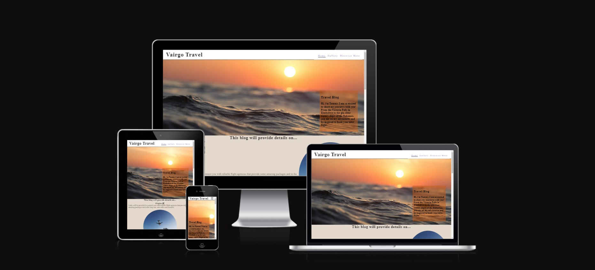

## FEATURES

### SITE WIDE

* Navigation Menu
  * Contains links to the Home, Gallery and Discover More pages and is responsive on all devices.
    * This allows users to navigate between the pages easily within the site on any device.
    * The logo also allows users to return to the Home page by clicking on it from anywhere in the site.

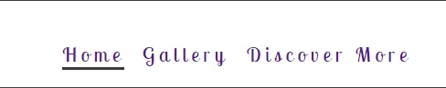

* Footer
  * This has links ot social media websites that will open in new tabs. Icons will be accessible to the visually impaired who may be using a screen reader by the use of aria-labels.


* Favicon
  * The favicon will display as an image on the left in the page window tab next to the page name. The favicon appears when the user is on any page.
  * The favicon makes it easy for users to identify and open the website if they have many tabs open on their screen.

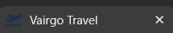

* 404 Page
  * A 404 page will be implemented and will display if a user navigates to a broken link.

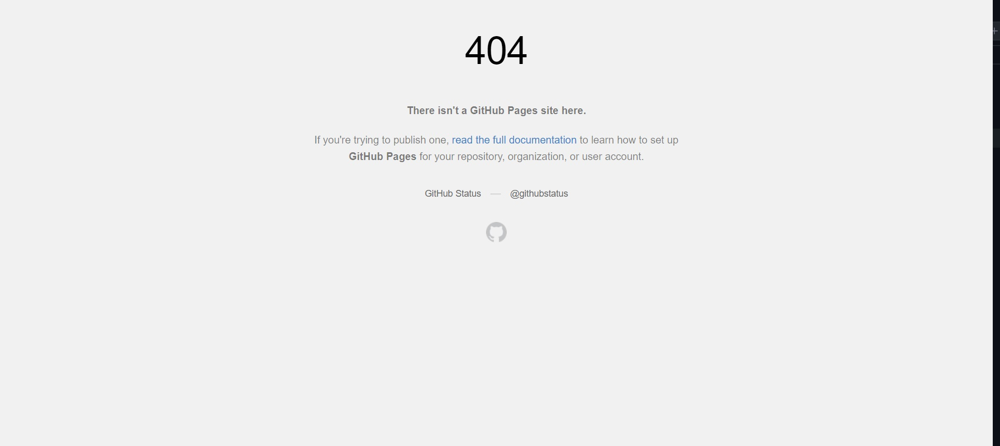

### LANDING PAGE

* Landing page image
  * The landing page is an image of water an a sunset which Tammy finds calming.
  * This shows users a bit about Tammy's personality and what sort of travel Tammy enjoys.

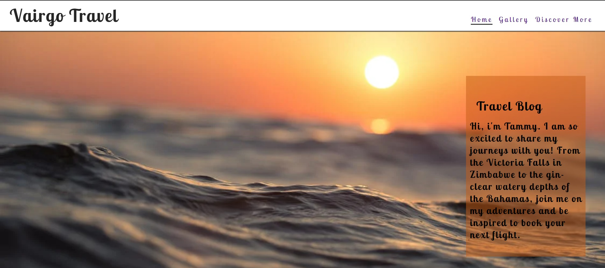

* Cover text
  * The cover text is a brief introduction to Tammy and highlights some places she has travelled giving the user insight on what the page is about at a glance.

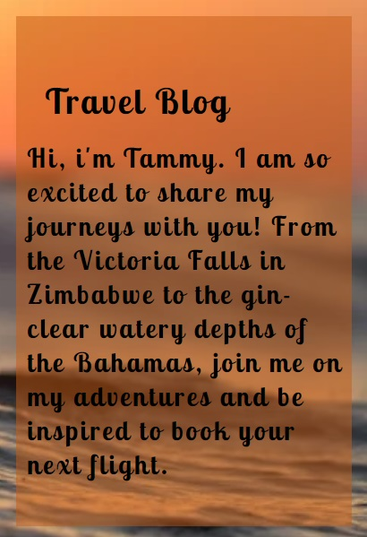

* Information paragraph on Flights, Accommodation and Recommendations
  * These paragraphs provide information on their name subject. They are brief and hint at what the user can expect when signing up thus prompting them to complete the sign up form.

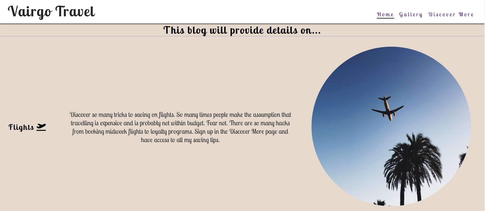
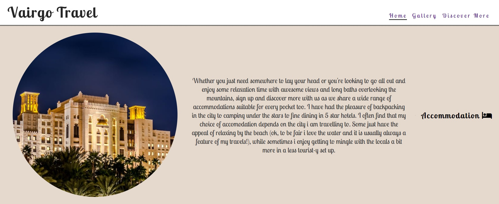
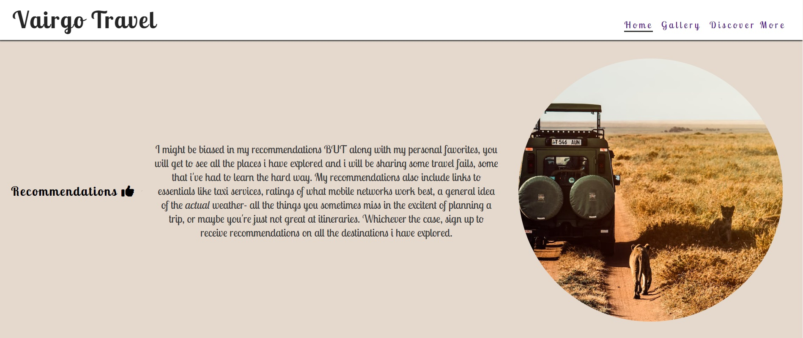

* Continents section
  * This section provides some brief information on each continent. It highlights some facts about each of them.
  * It also allows the user to determine what destination suits them which engages them early on in the website.

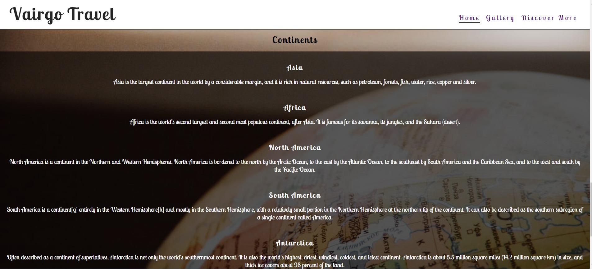

* Continents background image
  * The image of the globe is fitting as it depicts world travel which the website promotes.

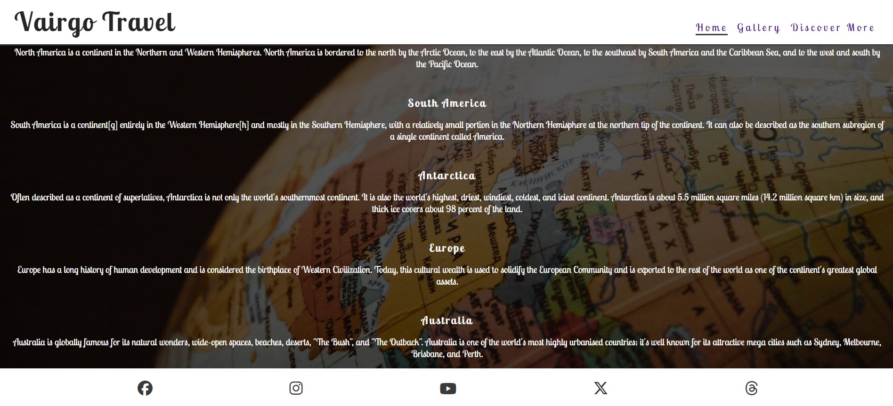

### GALLERY PAGE

* Gallery paragraph
  * The paragraph briefly depicts some of the images ot be seen in the gallery, highlighting the areas of some of the destinations.
  * This allows the user to view the images with the text in mind and engage with the website and ultimately want to discover more!

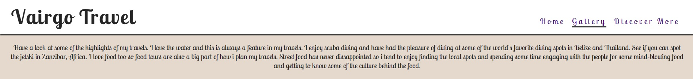

* Gallery images
  * The gallery shows Tammy's many travels and again highlights a bit about Tammy's personality allowing to relate to Tammy more.
  * The gallery on the other hand also provides inspiration to the user as it let's the users see what they can enjoy should they choose to engage more.

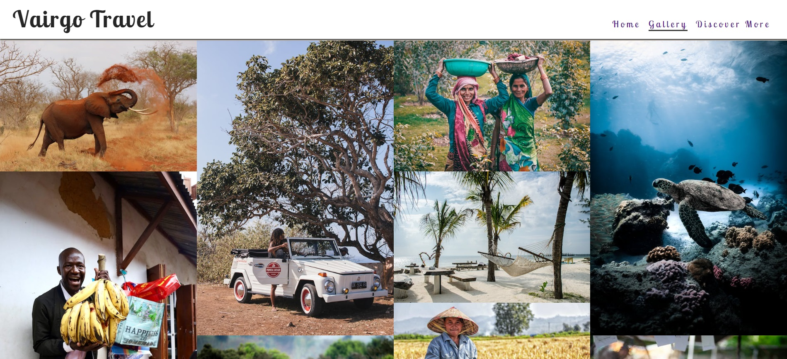
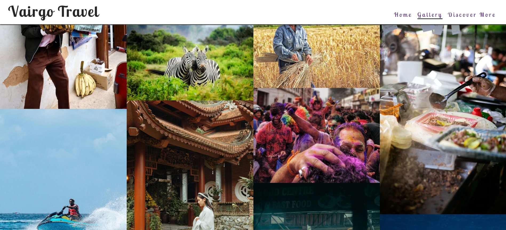
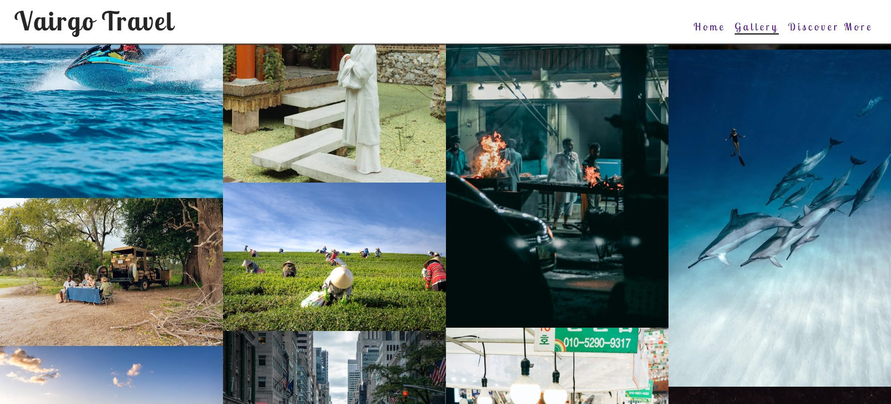
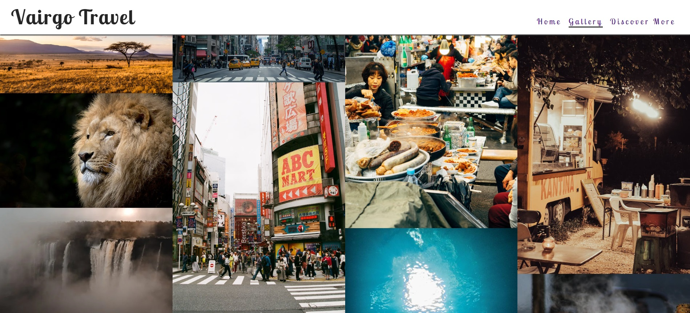
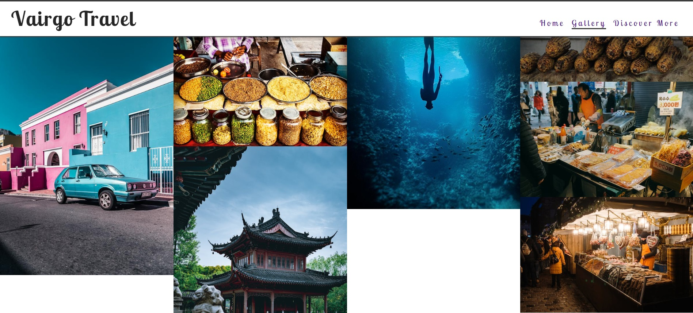
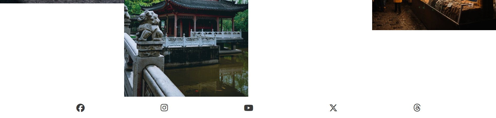

### DISCOVER MORE PAGE

* Discover more image
  * The image is fitting as it gives a sense of gentle nudging towards the user signing up with Vairgo Travel.

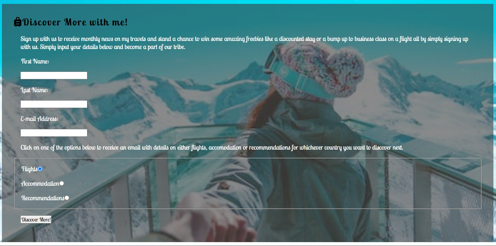

* Discover more (Sign up) form
  * The sign up form tells the user in a sentence what they benefit shoudl they wish to sign up
  * The forms is easy to read and has ample space around it to clearly identify what information is required.
  * The option for flights, accommodation or reocmmednations is also clearly distinguishable and makes for a user friendly experience.

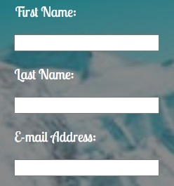


* Discover more (submit) button
  * The discover more button is clearly marked and large enough on all screen sizes to be clicked on ot tapped on in mobile format.

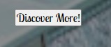

### EXISTING FEATURES

* Responsive design
* Responsive gallery with filtering'
* Sign up form and success page

### FEATURES TO IMPLEMENT

* A future enhancement would be to have a variety of text font to make the website more appealing.
* An about me section can be added to engage users with some fun facts about Tammy and some interesting stories of her travels.
* A page for each continent could be created and images shown separately on each link page with more descriptive text.

## TECHNOLOGIES

* HTML
  * HTML was the main language used to create the structure of the website.
* CSS
  * The website was styled using custom CSS.
* Codeanywhere
  * Codeanywhere IDE was used to develop the website
* GitHub
  * The source code is hosted on GitHub and the site was deployed using Git Pages
* Git
  * Git was used to commit and push code during the development of the website
* Font Awesome
  * Icons from <https://fontawesome.com/> were used for the social media links in the footer section and the favicon.
* Favicon
  * The favicon was created at <https://favicon.io/favicon-converter/>
  
## TESTING

### Responsiveness

All pages were tested to ensure responsiveness on screen sizes from 320px and upwards in <https://ui.dev/amiresponsive>, on Chrome and Microsoft Edge browsers.

Steps to test:

1. Open browser and navigate to <https://tammygirl2015.github.io/Vairgo/>
2. Open the developer tools (right click and inspect)
3. Set to responsive and decrease width to 320px
4. Click and drag the responsive window to maximum width

Expected:

Website is responsive on all screen sizes and no images are pixelated or stretched.
No horizontal scroll is present.
No elements overlap.

Actual:

Website behaved as expected.

The website was also opened on the following devices and no responsive issues were seen:

* iPhone 13
* iPhone 14
* Samsung Galaxy S9 Plus
* Samsung Galaxy Tablet

### Accessibility

Wave Accessibility (<https://wave.webaim.org/>) tool was used for final testing of the deployed website to check for and aid accessibility testing.

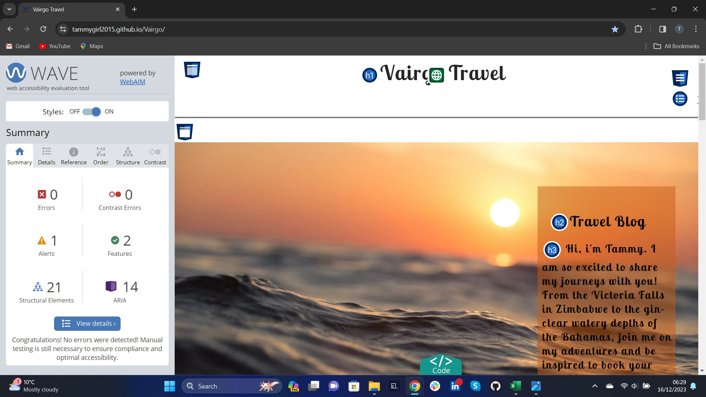

* All forms have associated labels or aria-labels so that this is read out on a screen reader to users who tab to form inputs
* Color contrasts meet a minimum ratio as specified in [WCAG 2.1 Contrast Guidelines](https://www.w3.org/WAI/WCAG21/Understanding/contrast-minimum.html)
* Heading levels are not missed or skipped to ensure the importance of content is relayed correctly to the end user
* All content is contained within landmarks to ensure ease of use for assistive technology, allowing the user to navigate by page regions
* All not textual content had alternative text or titles so descriptions are read out to screen readers
* HTML page lang attribute has been set
* Aria properties have been implemented correctl

### Lighthouse Testing

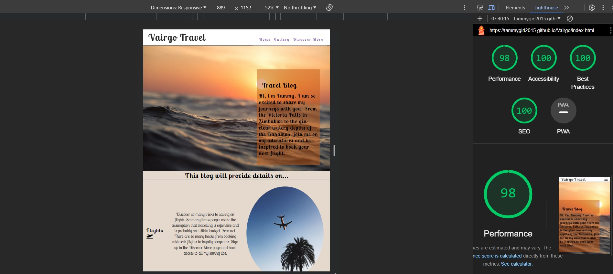
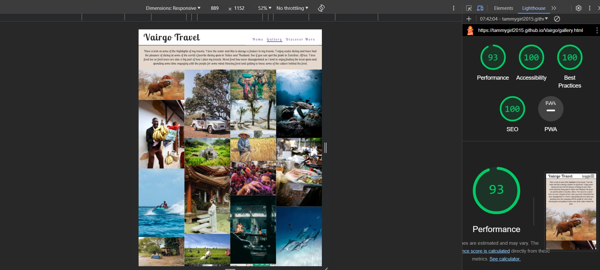
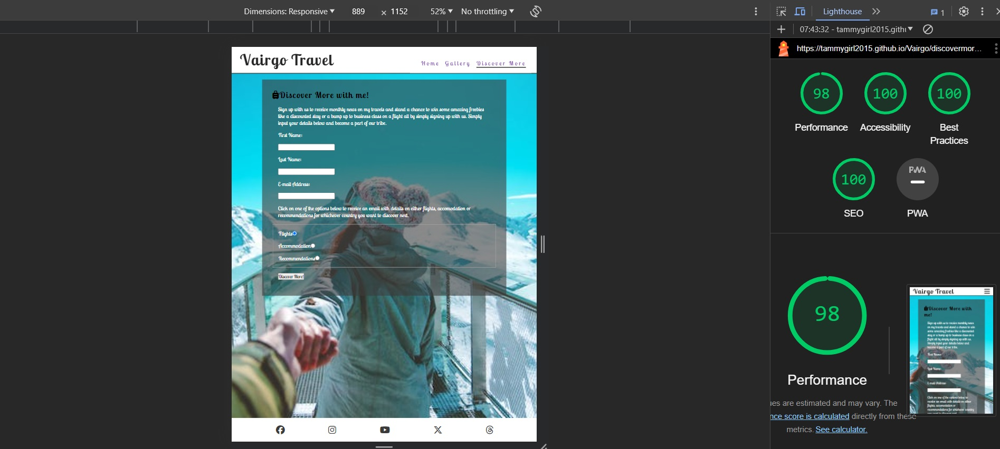

### Functional Testing

* Nav links
* Footer links
*

Description                                                                            |Action                                                             |Expected Result                                                                                                                                                                                                                                                           |Pass/Fail
---------------------------------------------------------------------------------------|---------------------------------------------------------------------|--------------------------------------------------------------------------------------------------------------------------------------------------------------------------------------------------------------------------------------------------------------------------|---------
Test Logo goes to correct page                                                         |Click on logo                                                        |Logo-> Home (index.html)                                                                                                                                                                                                                                                  |Pass
Test nav links go to correct pages                                                     |Click each link in the nav bar from each page                        |Home-> index.html; Gallery-> gallery.html; Discover More-> discovermore.html                                                                                                                                                                                              |Pass
Test footer links go to correct pages in new tab                                       |Click on link                                                        |Facebook-> <https://www.facebook.com>; Instagram-><https://www.instagram.com;> YouTube-><https://www.youtube.com;> Twitter(X)-><https://www.twitter.com;> Threads-><https://www.threads.com>                                                                                        |Pass
Test if the Discover More page form first name field requires input                    |Input text in field and click submit (Discover More!) button         |Page does not submit if first name and all required fields are not completed. If first name and all other fields are completed correctly, the page loads to code institute formdump congratulations page and displays input                                               |Pass
Test if the Discover More page form last name field requires input                     |Input text in field and click submit (Discover More!) button         |Page does not submit if last name and all required fields are not completed. If last name and all other fields are filled correctly, page loads to code institute formdump congratulations page and displays input                                                        |Pass
Test if the Discover More page form email address field requires email address         |Input email address in field and click submit (Discover More!) button|Page does not submit if an email address is not input and other input fields are not completed. If email address and all other fields are completed correctly, the page loads to code institute formdump congratulations page and displays input displaying provided input|Pass
Test if Discover More page form submit (Discover More!) button POSTS to correct address|Input required fields and click on submit (Discover More!) button    |Opens code institute formdump congratulations page and displays input                                                                                                                                                                                                     |Pass

### Validator Testing

* HTML


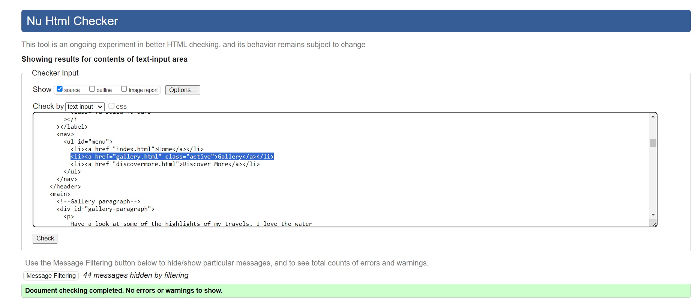
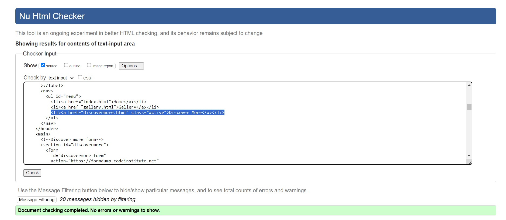
  
* CSS

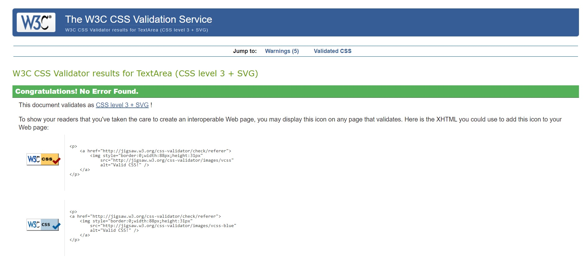

### Unfixed Bugs

* 1 warning in wave regarding a repititiive link.


* Some info indicated in html and css code regarding trailing slashes on void elements to be corrected at a later date.

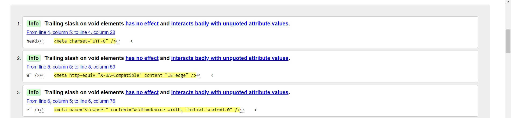

### Version Control

The site was created using the Codeanywhere code editor and pushed to github to the remote repository ‘Vairgo’.

The following git commands were used throughout development to push code to the remote repo:

```git add . <file>``` - This command was used to add the file(s) to the staging area before they are committed.

```git commit -m “commit message”``` - This command was used to commit changes to the local repository queue ready for the final step.

```git push``` - This command was used to push all committed code to the remote repository on github.

### Deployment to Github Pages

* The site was deployed to GitHub pages. The steps to deploy are as follows:
  * In the GitHub repository, navigate to the Settings tab
  * From the menu on left select 'Pages'
  * From the source section drop-down menu, select the Branch: main
  * Click 'Save'
  * A live link will be displayed in a green banner when published successfully.

The live link can be found here -  

### Clone the Repository Code Locally

Navigate to the GitHub Repository you want to clone to use locally:

* Click on the code drop down button
* Click on HTTPS
* Copy the repository link to the clipboard
* Open your IDE of choice (git must be installed for the next steps)
* Type git clone copied-git-url into the IDE terminal

The project will now have been cloned on your local machine for use.

## CREDITS

### Page Name

* The page name Vairgo Travel is credited to my good friend Calvin as homeage to him. He gave me permission to use the name and wanted me to include the link to his actual website: <https://www.vairgo.co.za>

### Format

* The format of the website is credited to the Love Running walkthrough project from Code Institute module 1.
* The READme is credited to the sample READme provided in the sample Portfolio Project 1 and another READme sample received from my amazing mentor Daisy McGirr.

### Content

* Content is credited to myself for text input with some inspiration from looking at <https://heyciara.com>

### Media

* All images used were taken from <https://pexels.com>
